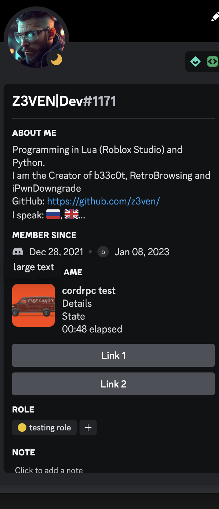

<h1 align="center">CordRPC</h1>

CordRPC - is a utility to create a cool menu in your discord profile.

<a href="LICENSE">License</a>
    
# 2.0 Update
- GUI Added
- Error handler
# Setup
* Download the CordRPC files
* Download python
* Use `pip3 install -r requirements.txt` to install the requirements
* Type `python3 cordrpc.py` and CordRPC will run.
# Configuring 

* `Client ID` - You can find the client id in [Discord Developer Portal](https://discord.com/developers/applications)/Your application/Oauth2/General
* `Large image` - This image will be displayed at Activity menu in your profile. You can edit it at [Discord Developer Portal](https://discord.com/developers/applications)/Your application/Rich Presence/ Art assets. NOTE! On some clients the image won't seem
* `Large text` - This parameter is a text that will be displayed when you point at the image
* `Update time` - Time after menu will disappear
* Other params you can see here

## Example
* `Client ID` - 1094627712070582333
* `Large image` - bb6
* `Large text` - large text
* `Details` - Details
* `State` - State
* `Update time` - 60
* Button 1:
`Label` - Link 1
`Url` - https://youtube.com
* Button 2:
`Label` - Link 2
`Url` - https://github.com

And the menu:

# NOTES!
* The bold text is the name of your bot. Please remember it.
* If you close CordRPC, the menu will disappear
* ONLY 2 BUTTONS
* Dont use Python 2 for executing the code
# Contributing
When you are doing a commit, please name it shortly and correctly, all necessary info about the commit please keep in the description. Thanks for your attention.
